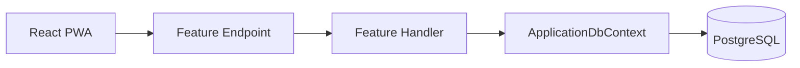
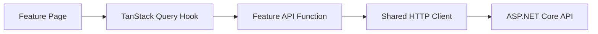

# Architecture Guidelines

Create an architecture appropriate for both the frontend and backend.

The architecture must be maintainable, modular, easy to navigate, and appropriate for the current scope of the application.

Do not implement full Clean Architecture.

Do not introduce architectural layers, projects, abstractions, interfaces, or patterns only for theoretical purity or possible future requirements.

Prefer a pragmatic modular architecture that keeps related code close together.

---

# 1. General Architecture Principles

Follow these principles:

* Organize code primarily by business feature.
* Keep dependencies explicit and easy to understand.
* Keep related files close together.
* Avoid unnecessary indirection.
* Avoid abstractions with only one implementation unless they provide a clear benefit.
* Prefer composition over inheritance.
* Keep the initial solution simple enough for one developer to understand and modify.
* Add complexity only when an actual requirement justifies it.
* Do not create folders only to satisfy a predefined architecture diagram.
* Do not create empty placeholder layers or projects.
* Do not move simple code through multiple layers without adding meaningful behavior.
* Ensure the code remains testable without designing the entire application around mocking.

The desired architecture is:

```text
Frontend: Feature-Based Architecture
Backend: Modular Monolith with pragmatic Vertical Slices
```

---

# 2. Frontend Architecture

Use a feature-based React architecture.

Do not organize the entire frontend only through global folders such as:

```text
components/
hooks/
services/
pages/
```

Instead, keep feature-specific components, API calls, schemas, hooks, and types inside their corresponding feature.

Use this approximate structure:

```text
apps/web/src/
├── app/
│   ├── providers/
│   ├── router/
│   ├── layouts/
│   └── config/
├── features/
│   ├── auth/
│   ├── dashboard/
│   ├── gear-lists/
│   ├── gear-items/
│   ├── purchased-items/
│   └── settings/
├── shared/
│   ├── api/
│   ├── components/
│   ├── hooks/
│   ├── lib/
│   ├── types/
│   └── utils/
├── pwa/
│   ├── offline/
│   ├── storage/
│   └── service-worker/
├── assets/
├── main.tsx
└── index.css
```

This structure is a guideline rather than a requirement to create every folder immediately.

Only create folders when they contain actual code.

## Feature structure

A feature may use the following internal structure:

```text
features/gear-items/
├── api/
├── components/
├── hooks/
├── pages/
├── schemas/
├── types/
└── utils/
```

Not every feature needs every folder.

For example, a small feature may initially contain:

```text
features/settings/
├── SettingsPage.tsx
└── useUpdateProfile.ts
```

Do not create empty folders.

## Frontend layer responsibilities

### `app`

Contains application-level composition:

* Router configuration.
* Global providers.
* Application layouts.
* Query client setup.
* Authentication bootstrap.
* Theme configuration.
* Error boundaries.
* Global application configuration.

The `app` folder must not contain feature-specific business logic.

### `features`

Contains business functionality.

Each feature should own:

* Feature-specific UI components.
* Feature-specific API calls.
* Query and mutation hooks.
* Forms and schemas.
* Feature-specific types.
* Feature-specific utility functions.
* Pages primarily associated with the feature.

Features should not depend directly on the internal implementation of other features.

When two features need the same code, determine whether it is truly shared before moving it into `shared`.

Do not move code to `shared` simply because it might be reused later.

### `shared`

Contains reusable application primitives.

Examples:

* HTTP client.
* Generic buttons, dialogs, cards, and form controls.
* Generic hooks.
* Date and currency formatting.
* Common API error types.
* Generic loading, empty, and error states.
* Shared utilities with no feature-specific business meaning.

Shared code must not depend on feature code.

### `pwa`

Contains PWA-specific behavior:

* IndexedDB configuration.
* Cached API response storage.
* Offline fallback logic.
* Connectivity detection.
* Service Worker update handling.
* PWA installation utilities.

Do not mix PWA storage logic directly into presentation components.

---

# 3. Frontend Dependency Direction

Use the following dependency direction:

```text
app
├── features
├── shared
└── pwa

features
├── shared
└── pwa when offline behavior is required

pwa
└── shared

shared
└── must not depend on app or features
```

Avoid circular dependencies.

Use clear public exports when beneficial, but do not create excessive `index.ts` barrel files.

Do not use barrel files when they make dependencies harder to understand or create circular references.

---

# 4. Frontend State Management

Use TanStack Query for server state.

Server state includes:

* Current user.
* Gear lists.
* Gear items.
* Dashboard summaries.
* Purchased items.
* API loading and error states.

Do not duplicate server state in Zustand or React Context.

Use React local state for component-level UI state.

Use Zustand only for genuine client-side state that must be shared across distant components, such as:

* Theme.
* Sidebar state.
* Active drag-and-drop UI state.
* Non-persistent modal coordination.

Use React Context only for stable cross-cutting dependencies such as authentication bootstrap or theme integration when appropriate.

Do not introduce Redux.

---

# 5. Frontend API Layer

Create one central HTTP client in:

```text
shared/api/
```

It should handle:

* Base URL.
* JSON serialization.
* Authentication headers.
* Access-token renewal.
* Standard API errors.
* Request cancellation when possible.

Feature-specific API operations must remain inside their feature.

Example:

```text
features/gear-items/api/
├── createGearItem.ts
├── updateGearItem.ts
├── deleteGearItem.ts
├── getGearItems.ts
└── reorderGearItems.ts
```

Alternatively, related operations may be grouped in a single file when the feature is small.

Do not create a generic API repository abstraction over every endpoint.

Do not create one large global `apiService.ts` containing every backend call.

---

# 6. Frontend Components

Differentiate between shared UI primitives and feature components.

Examples of shared components:

```text
Button
Dialog
Input
Select
LoadingState
ErrorState
EmptyState
ConfirmDialog
```

Examples of feature components:

```text
GearItemCard
GearPriorityColumn
CreateGearListDialog
PurchasedItemRow
DashboardSummaryCard
```

Keep feature behavior inside feature components and hooks.

Avoid components that contain API calls, complex form logic, routing logic, drag-and-drop behavior, and visual rendering all in one file.

Split components when doing so improves readability, but do not split trivial components into unnecessary files.

---

# 7. Backend Architecture

Use a modular monolith organized with pragmatic vertical slices.

Start with a single ASP.NET Core Web API project.

Do not create separate projects for Domain, Application, Infrastructure, and API during the MVP.

Use this approximate structure:

```text
apps/api/
├── Features/
│   ├── Authentication/
│   ├── GearLists/
│   ├── GearItems/
│   ├── Dashboard/
│   └── Users/
├── Domain/
│   ├── Entities/
│   └── Enums/
├── Persistence/
│   ├── Configurations/
│   ├── Migrations/
│   ├── ApplicationDbContext.cs
│   └── DevelopmentDataSeeder.cs
├── Infrastructure/
│   ├── Authentication/
│   ├── Time/
│   └── Services/
├── Common/
│   ├── Errors/
│   ├── Extensions/
│   ├── Models/
│   └── Security/
├── Middleware/
├── Program.cs
└── appsettings.json
```

This structure is a guideline.

Only create folders and abstractions that contain meaningful implementation.

---

# 8. Backend Feature Structure

Organize application behavior primarily by feature and operation.

For example:

```text
Features/GearItems/
├── Create/
│   ├── CreateGearItemEndpoint.cs
│   ├── CreateGearItemRequest.cs
│   ├── CreateGearItemResponse.cs
│   ├── CreateGearItemValidator.cs
│   └── CreateGearItemHandler.cs
├── Update/
│   ├── UpdateGearItemEndpoint.cs
│   ├── UpdateGearItemRequest.cs
│   ├── UpdateGearItemValidator.cs
│   └── UpdateGearItemHandler.cs
├── Delete/
├── GetById/
├── GetListItems/
├── ChangeStatus/
└── Reorder/
```

For small operations, the endpoint and handler may be combined when separating them would only add ceremony.

For example, a simple read endpoint may be implemented as:

```text
Features/GearLists/GetAll/GetGearListsEndpoint.cs
```

with the query logic inside the endpoint.

For operations with validation, transactions, concurrency handling, or substantial business logic, create a separate handler or service.

Do not enforce one class per architectural concept when it adds no value.

---

# 9. Backend Responsibilities

## Features

Each feature owns its application use cases.

A feature may contain:

* Endpoints or controllers.
* Request DTOs.
* Response DTOs.
* Validators.
* Query logic.
* Command logic.
* Feature-specific mapping.
* Feature-specific helper services.

Features may use:

* `ApplicationDbContext`.
* Shared infrastructure services.
* Domain entities.
* Common error and security utilities.

Features must not directly expose Entity Framework entities through API responses.

## Domain

The Domain folder contains:

* Entities.
* Enums.
* Domain rules that naturally belong to the entities.
* Value objects only when they provide real value.

Keep entities focused and practical.

Do not force all business logic into entities.

Do not create aggregate roots, domain events, factories, or value objects unless an actual business rule requires them.

The current entities may remain mostly persistence-oriented while still protecting important invariants.

## Persistence

The Persistence folder contains:

* `ApplicationDbContext`.
* Entity Framework configurations.
* Migrations.
* Database seeding.
* Database-specific setup.

Use Fluent API configurations for non-trivial entity configuration.

Do not add a generic repository over Entity Framework Core.

Do not add a custom Unit of Work abstraction.

`ApplicationDbContext` already provides repository-like access and transactional unit-of-work behavior.

## Infrastructure

The Infrastructure folder contains technical implementations that are not feature-specific.

Examples:

* JWT token generation.
* Refresh-token services.
* Password or token hashing helpers.
* Time provider integrations.
* External storage adapters.
* Email delivery when introduced later.

Create interfaces only when:

* Multiple implementations are expected.
* Tests need to replace an external side effect.
* The implementation represents an external boundary.
* The abstraction has a meaningful business or technical contract.

Do not create interfaces for every class by default.

## Common

The Common folder contains genuinely cross-cutting code.

Examples:

* Current user helpers.
* Shared API error models.
* `ProblemDetails` extensions.
* Pagination models.
* Shared authorization helpers.
* Correlation ID helpers.

Do not turn `Common` into a miscellaneous dumping ground.

If code belongs to one feature, keep it in that feature.

---

# 10. Backend Dependency Direction

Use this practical dependency direction:

```text
Features
├── Domain
├── Persistence
├── Infrastructure
└── Common

Persistence
└── Domain

Infrastructure
├── Domain when needed
└── Common when needed

Domain
└── should not depend on Features, Persistence, or ASP.NET Core
```

Because the MVP uses one project, these boundaries are organizational rather than separately compiled assemblies.

Maintain them through code structure and review rather than additional projects.

Do not create project references solely to enforce boundaries during the MVP.

---

# 11. Endpoints

Choose either Minimal APIs or Controllers and use the choice consistently.

Preferred approach:

```text
ASP.NET Core Minimal APIs grouped by feature
```

Use endpoint registration extensions such as:

```csharp
public static class GearItemEndpoints
{
    public static IEndpointRouteBuilder MapGearItemEndpoints(
        this IEndpointRouteBuilder endpoints)
    {
        var group = endpoints
            .MapGroup("/api/gear-lists/{listId:guid}/items")
            .RequireAuthorization();

        // Map feature endpoints.

        return endpoints;
    }
}
```

A feature may expose one registration method that maps its routes.

Keep endpoint methods small.

Endpoints should primarily:

* Bind the request.
* Resolve the authenticated user.
* Invoke the operation.
* Return an appropriate HTTP result.

Complex validation, transactions, ordering, ownership checks, or concurrency handling should live in a handler or feature service.

Do not create controller base classes or generic endpoint frameworks.

---

# 12. Application Logic

Use simple handlers or feature services for non-trivial operations.

Example:

```csharp
public sealed class ReorderGearItemsHandler
{
    private readonly ApplicationDbContext _dbContext;

    public ReorderGearItemsHandler(ApplicationDbContext dbContext)
    {
        _dbContext = dbContext;
    }

    public async Task<Result> HandleAsync(
        Guid userId,
        Guid listId,
        ReorderGearItemsRequest request,
        CancellationToken cancellationToken)
    {
        // Ownership validation.
        // Item validation.
        // Concurrency validation.
        // Transactional update.
    }
}
```

A handler may use `ApplicationDbContext` directly.

Do not create:

* `IGearItemRepository`.
* `GearItemRepository`.
* `IUnitOfWork`.
* `UnitOfWork`.

unless a concrete requirement appears that cannot be handled cleanly by Entity Framework Core.

Use Entity Framework Core directly and intentionally.

---

# 13. Data Access Rules

Apply these rules:

* Filter in the database.
* Project directly to response DTOs for read operations.
* Use `AsNoTracking` for read-only queries.
* Avoid loading entire tables.
* Avoid unnecessary `Include` calls.
* Avoid N+1 queries.
* Pass `CancellationToken`.
* Use transactions only when an operation requires atomic updates.
* Use optimistic concurrency for gear-item updates.
* Use decimal types for monetary values.
* Keep database queries visible and understandable.

Prefer:

```csharp
var items = await dbContext.GearItems
    .AsNoTracking()
    .Where(item =>
        item.GearListId == listId &&
        item.GearList.OwnerId == userId)
    .OrderBy(item => item.Priority)
    .ThenBy(item => item.Position)
    .Select(item => new GearItemResponse(
        item.Id,
        item.Name,
        item.Priority,
        item.Status,
        item.EstimatedPrice,
        item.Position,
        item.Version))
    .ToListAsync(cancellationToken);
```

Avoid hiding straightforward Entity Framework queries behind generic abstractions.

---

# 14. Validation

Use FluentValidation for request validation when the request contains meaningful rules.

Keep validators close to their operation.

Example:

```text
Features/GearItems/Create/CreateGearItemValidator.cs
```

Do not create a global validation layer disconnected from the feature.

Database-dependent validation such as ownership and version checks should be handled inside the operation handler.

Input-shape validation should be handled by FluentValidation.

---

# 15. Mapping

Use explicit manual mapping for the MVP.

Do not introduce AutoMapper.

Prefer constructors, factory methods, or simple mapping functions.

Example:

```csharp
private static GearItemResponse MapResponse(GearItem entity)
{
    return new GearItemResponse(
        entity.Id,
        entity.Name,
        entity.Description,
        entity.Priority,
        entity.Status,
        entity.EstimatedPrice,
        entity.ActualPrice,
        entity.Position,
        entity.Version);
}
```

When read operations can project directly from Entity Framework Core into DTOs, prefer direct projection instead of loading entities and mapping afterward.

---

# 16. Error Handling

Use one global exception-handling middleware or ASP.NET Core exception handler.

Use `ProblemDetails` consistently.

Expected business outcomes should not be represented by unhandled exceptions.

Examples:

* Validation failure: `400 Bad Request`.
* Unauthenticated: `401 Unauthorized`.
* Forbidden access: `403 Forbidden`, or consistently use `404` to hide resource existence.
* Missing resource: `404 Not Found`.
* Concurrency conflict: `409 Conflict`.

Do not add a complicated hierarchy of custom exceptions.

Use small result types or explicit endpoint results where they make control flow clearer.

---

# 17. Authentication and Current User

Provide one clear mechanism to obtain the authenticated user ID.

For example:

```text
Common/Security/CurrentUserExtensions.cs
```

or a small scoped service when it provides clear value.

Do not repeatedly parse claims manually in every endpoint.

Do not trust user IDs or owner IDs supplied by the frontend.

Ownership must always be determined and validated on the backend.

---

# 18. Testing Architecture

Tests should follow features and behaviors rather than internal layers.

Backend tests may use:

```text
tests/api-tests/
├── Authentication/
├── GearLists/
├── GearItems/
└── Dashboard/
```

Prefer integration tests for:

* Authentication.
* Authorization.
* Persistence.
* Ownership.
* Concurrency.
* Reordering.
* API responses.

Use unit tests only for isolated logic that benefits from them.

Do not mock Entity Framework Core queries unnecessarily.

Do not create interfaces solely to make every class mockable.

Frontend tests should remain near the feature or under:

```text
tests/web-tests/
```

Test user-visible behavior rather than component implementation details.

---

# 19. Architecture Rules to Avoid Over-Engineering

Do not introduce any of the following unless explicitly justified by an implemented requirement:

* Full Clean Architecture.
* Onion Architecture ceremony.
* Hexagonal Architecture ceremony.
* Separate project per layer.
* Generic Repository Pattern.
* Custom Unit of Work.
* MediatR.
* Formal CQRS infrastructure.
* Event sourcing.
* Domain events.
* Message bus.
* Microservices.
* Specification Pattern.
* AutoMapper.
* Abstract factories.
* Generic service base classes.
* Generic endpoint base classes.
* An interface for every implementation.
* Excessive dependency injection registrations.
* Reflection-based automatic module discovery.
* Complex result or error frameworks.
* Premature shared libraries.
* Premature npm workspace packages for DTO sharing.
* Backend-for-Frontend services.
* GraphQL.
* SignalR during the MVP.
* Offline write synchronization during the MVP.

If Codex believes one of these is necessary, it must first:

1. Identify the concrete requirement.
2. Explain why the simpler implementation is insufficient.
3. Choose the smallest possible addition.
4. Document the decision in the architecture notes.

Do not add a pattern merely because it is considered a best practice in larger systems.

---

# 20. Architecture Decision Criteria

Before creating an abstraction, ask:

1. Does this remove actual duplication?
2. Does this isolate an external system?
3. Does this protect an important business rule?
4. Does this make the current code easier to understand?
5. Is there more than one real implementation?
6. Does it make testing a meaningful behavior easier?
7. Is the abstraction simpler than the code it replaces?

If the answer to all or most of these questions is no, do not create the abstraction.

Prefer duplication of a few obvious lines over a premature and unclear abstraction.

Refactor after repeated patterns become visible.

---

# 21. Expected Architecture Documentation

Create:

```text
docs/architecture.md
```

Document:

* High-level frontend structure.
* High-level backend structure.
* Dependency directions.
* Main modules and responsibilities.
* Authentication flow.
* Request flow.
* Offline read flow.
* Data persistence flow.
* Key decisions.
* Explicitly rejected patterns.
* Conditions that could justify future extraction into separate projects.

Keep the documentation practical and synchronized with the actual code.

Do not document architecture that has not been implemented.

Include diagrams using Mermaid when useful.

Example backend request flow:



Example frontend data flow:



---

# 22. Initial Architecture Deliverable

Before implementing all product features:

1. Inspect the current repository.
2. Propose the concrete frontend and backend folder structures.
3. Explain the responsibility of each top-level folder.
4. Verify that no unnecessary Clean Architecture projects or abstractions are being introduced.
5. Create `docs/architecture.md`.
6. Scaffold only the folders needed by the first implementation stage.
7. Do not create empty folders for future stages.
8. Build the frontend and backend.
9. Run the available tests.
10. Summarize the architectural decisions and any deliberate simplifications.

After this architecture baseline is stable, continue with the implementation stages defined in the main project prompt.