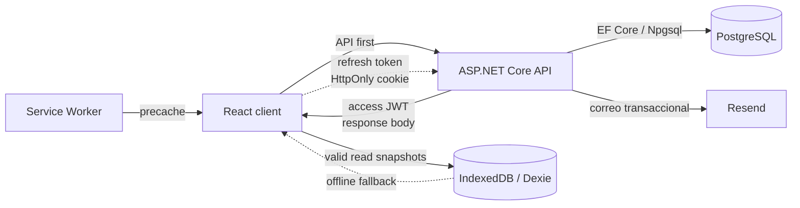
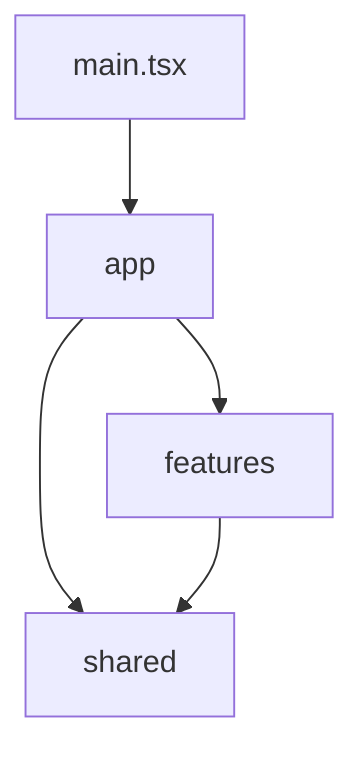
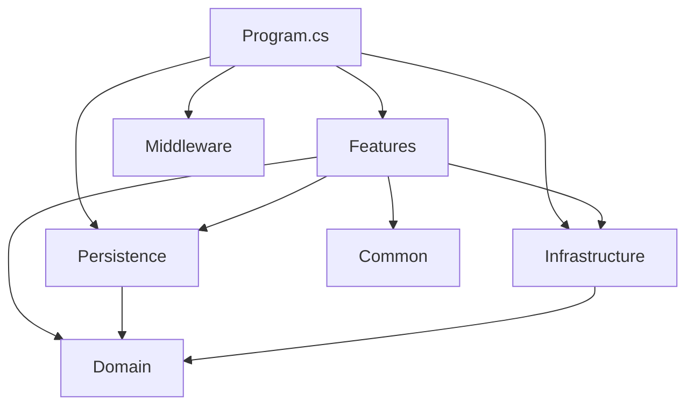
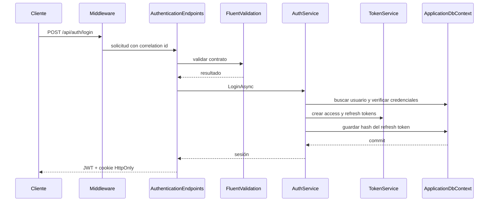
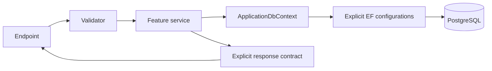

# Arquitectura de Gear List

## Estado y alcance

Este documento describe la arquitectura implementada al finalizar la Etapa 9.
Es el contrato de organización para las etapas siguientes y complementa a
`PROJECT_ARCHITECTURE.md`.

Gear List se organiza como:

- un frontend React con arquitectura basada en features;
- un backend ASP.NET Core como monolito modular pragmático;
- PostgreSQL como fuente de verdad;
- un único proyecto desplegable para la API.

La estructura busca límites claros sin introducir proyectos por capa,
repositorios genéricos ni mediadores que no aportan valor al MVP actual.

## Vista general



## Estructura actual

Sólo se crean carpetas que contienen implementación real.

```text
frontend/src/
├── app/
│   ├── layouts/
│   ├── providers/
│   ├── router/
│   ├── ApplicationErrorBoundary.tsx
│   ├── App.test.tsx
│   └── App.tsx
├── features/
│   ├── auth/
│   │   ├── api/
│   │   ├── components/
│   │   ├── pages/
│   │   ├── AuthProvider.tsx
│   │   └── types.ts
│   ├── dashboard/
│   │   ├── api/
│   │   ├── hooks/
│   │   ├── pages/
│   │   └── types.ts
│   ├── gear-items/
│   │   ├── api/
│   │   ├── components/
│   │   ├── hooks/
│   │   └── types.ts
│   ├── gear-lists/
│   │   ├── api/
│   │   ├── components/
│   │   ├── hooks/
│   │   ├── pages/
│   │   └── types.ts
│   └── settings/
│       └── pages/
├── shared/
│   ├── api/
│   ├── components/
│   ├── lib/
│   ├── theme/
│   └── types/
├── pwa/
│   ├── offline/
│   │   ├── NetworkProvider.tsx
│   │   ├── NetworkNotices.tsx
│   │   └── offlineQuery.ts
│   ├── service-worker/
│   │   ├── PwaNotices.tsx
│   │   └── PwaProvider.tsx
│   └── storage/
│       ├── cacheKeys.ts
│       ├── offlineDatabase.ts
│       └── offlineIdentity.ts
├── test/
│   ├── accessibility.ts
│   └── setup.ts
├── index.css
├── main.tsx
└── vite-env.d.ts
```

```text
backend/
├── Common/
│   ├── Errors/
│   │   └── ValidationResultExtensions.cs
│   └── Security/
│       └── CurrentUserExtensions.cs
├── Domain/
│   ├── Entities/
│   │   ├── ApplicationUser.cs
│   │   ├── GearItem.cs
│   │   ├── GearList.cs
│   │   └── RefreshToken.cs
│   └── Enums/
│       ├── GearCategory.cs
│       ├── PurchasePriority.cs
│       └── PurchaseStatus.cs
├── Features/
│   ├── Authentication/
│   │   ├── AuthCookie.cs
│   │   ├── AuthenticationContracts.cs
│   │   ├── AuthenticationEndpoints.cs
│   │   ├── AuthenticationValidators.cs
│   │   ├── AuthService.cs
│   │   ├── PasswordRecoveryOptions.cs
│   │   └── PasswordResetEmailSender.cs
│   ├── Dashboard/
│   │   ├── DashboardContracts.cs
│   │   ├── DashboardEndpoints.cs
│   │   └── DashboardService.cs
│   ├── GearItems/
│   │   ├── GearItemContracts.cs
│   │   ├── GearItemEndpoints.cs
│   │   ├── GearItemReorderContracts.cs
│   │   ├── GearItemReorderService.cs
│   │   ├── GearItemReorderValidator.cs
│   │   ├── GearItemService.cs
│   │   └── GearItemValidators.cs
│   └── GearLists/
│       ├── GearListContracts.cs
│       ├── GearListEndpoints.cs
│       ├── GearListService.cs
│       └── GearListValidators.cs
├── Infrastructure/
│   ├── Authentication/
│   │   ├── JwtOptions.cs
│   │   └── TokenService.cs
│   └── Health/
│       ├── DatabaseHealthCheck.cs
│       └── HealthResponseWriter.cs
├── Middleware/
│   ├── CorrelationIdMiddleware.cs
│   └── ExceptionHandlingMiddleware.cs
├── Persistence/
│   ├── Configurations/
│   ├── Migrations/
│   ├── ApplicationDbContext.cs
│   └── ApplicationDbContextFactory.cs
└── Program.cs
```

Las pruebas reflejan esos límites:

```text
backend-tests/
├── Features/Authentication/
├── Features/Dashboard/
├── Features/GearItems/
├── Features/GearLists/
├── Infrastructure/
├── Middleware/
└── Persistence/
```

## Frontend

### Responsabilidades

- `app/` compone la aplicación y sus providers. No contiene lógica de negocio.
- `features/` contiene UI, datos locales, hooks, esquemas y acceso remoto propios
  de una capacidad del producto.
- `shared/` contiene piezas reutilizables y agnósticas a cualquier feature.
- `test/` contiene la configuración compartida de Vitest.
- `index.css` contiene los tokens y estilos globales adaptados de Boreal Design
  System.

La feature `dashboard` consume agregados persistidos, muestra la próxima compra
y aloja el historial. `gear-lists` administra tarjetas y la pantalla de detalle;
`gear-items` encapsula formularios, queries, mutaciones y el board accesible con
dnd-kit. `auth` mantiene el access token sólo en memoria y renueva la sesión con
la cookie `HttpOnly`.

### Dirección de dependencias



Reglas:

- `shared` no importa desde `app` ni desde `features`;
- una feature no accede a detalles internos de otra feature;
- el estado remoto se administra con TanStack Query;
- `shared/api` contiene el único cliente HTTP base;
- cada feature conservará sus funciones de API, claves de query y esquemas;
- no se crea una carpeta o abstracción antes de que tenga un uso concreto.

`AppProviders` compone `QueryClient`, conectividad, PWA, tema y sesión. React
Router protege las rutas privadas. Las mutaciones invalidan listas, items y
resúmenes afectados. `useReorderGearItems` invalida la query también ante
conflictos para recuperar el snapshot actual del servidor. Los errores HTTP
4xx no se reintentan automáticamente; un 401 de una operación protegida
dispara un único intento central de refresh y limpia la sesión si falla.

### Calidad y accesibilidad

`ApplicationErrorBoundary` contiene fallos inesperados de render y ofrece una
recuperación explícita. Las pantallas remotas usan estados compartidos de
loading, error con retry y vacío, mientras `OperationFeedback` diferencia
semánticamente resultados exitosos y fallidos.

`RouteExperience` actualiza el título del documento, anuncia cambios de ruta y
mueve el foco al landmark principal. Los layouts ofrecen skip links. `Modal`
atrapa el foco, permite cerrar con Escape, bloquea el scroll de fondo y devuelve
el foco al disparador. Los formularios conectan validaciones con sus controles.
El board mantiene soporte de puntero y teclado con instrucciones y anuncios
localizados de dnd-kit.

Vitest verifica comportamiento observable, incluidos errores fatales, sesión
vencida, foco de modales, estados de consulta, PWA y persistencia offline.
axe-core agrega una auditoría semántica automatizada sobre la pantalla de
acceso; el contraste visual se excluye de esa prueba porque jsdom no renderiza
píxeles y debe complementarse en navegador real.

## Backend

### Responsabilidades

- `Features/` contiene casos de uso verticales, contratos HTTP, validación y
  endpoints Minimal API agrupados por capacidad.
- `Domain/` contiene entidades y enums compartidos por los casos de uso.
- `Persistence/` contiene `ApplicationDbContext`, configuraciones EF explícitas
  y migraciones.
- `Infrastructure/` contiene detalles técnicos, como JWT, generación y hash de
  tokens, y health checks.
- `Common/` se reserva para conceptos transversales pequeños y genuinos. El
  acceso tipado al usuario actual vive en `Common/Security`.
- `Middleware/` contiene comportamiento del pipeline HTTP.
- `Program.cs` es el composition root explícito.

`ApplicationUser` hereda de `IdentityUser<Guid>`. Esta es una dependencia
deliberada de ASP.NET Core Identity dentro del modelo, aceptada para evitar
duplicar modelos de usuario y mapeos durante el MVP.

### Dirección de dependencias



El dominio no conoce features, endpoints, middleware ni persistencia. Las
features pueden usar EF Core directamente: no existe una capa de repositorios
que duplique a `DbContext`.

### Flujo de una solicitud de autenticación



El pipeline aplica correlation ID, logging estructurado, manejo global de
errores con Problem Details, CORS, rate limiting, autenticación y autorización.

### Endpoints y seguridad

Los endpoints implementados son:

- `POST /api/auth/register`
- `POST /api/auth/login`
- `POST /api/auth/forgot-password`
- `POST /api/auth/reset-password`
- `POST /api/auth/refresh`
- `POST /api/auth/logout`
- `GET /api/auth/me`

La feature Gear Lists implementa:

- `GET /api/gear-lists`
- `GET /api/gear-lists/{id}`
- `POST /api/gear-lists`
- `PUT /api/gear-lists/{id}`
- `DELETE /api/gear-lists/{id}`

Todos estos endpoints requieren autenticación. El identificador del propietario
se obtiene exclusivamente del claim `sub`; nunca forma parte de un request. Las
consultas filtran simultáneamente por recurso, propietario y estado activo, por
lo que un recurso ajeno o inexistente devuelve consistentemente `404 Not Found`.
El delete es un archivado lógico y las lecturas excluyen listas archivadas.

La feature Gear Items implementa:

- `GET /api/gear-lists/{listId}/items`
- `GET /api/gear-lists/{listId}/items/{itemId}`
- `POST /api/gear-lists/{listId}/items`
- `PUT /api/gear-lists/{listId}/items/{itemId}`
- `DELETE /api/gear-lists/{listId}/items/{itemId}`
- `PATCH /api/gear-lists/{listId}/items/{itemId}/status`
- `PUT /api/gear-lists/{listId}/items/reorder`

Todas las operaciones validan simultáneamente que la lista esté activa, que
pertenezca al usuario autenticado y que el item pertenezca a esa lista. Los
items se eliminan físicamente. Una creación se agrega al final de su prioridad;
si un PUT cambia la prioridad, el item se agrega al final de la nueva.

`PurchasedAt` es controlado por el servidor: se establece al entrar en
`Purchased` y se limpia al salir de ese estado. Cada PUT o PATCH exitoso genera
un nuevo `Version` y actualiza `UpdatedAt`. Una versión obsoleta devuelve
`409 Conflict` junto con el snapshot actual para que el cliente pueda recargar.

El endpoint de reorder exige un snapshot completo. Los IDs deben ser únicos y
las posiciones, contiguas desde cero dentro de cada prioridad. El servicio
verifica en una transacción que el conjunto coincida con los items actuales,
que todos pertenezcan a la lista autenticada y que ninguna versión esté
obsoleta. Sólo entonces actualiza prioridad, posición, versión y timestamp de
todos los items. Cualquier diferencia produce rollback y un `409 Conflict` con
el orden vigente.

El JWT de acceso es de vida corta y se devuelve en el cuerpo. El refresh token:

- se genera con aleatoriedad criptográfica;
- se persiste únicamente como SHA-256;
- se entrega mediante cookie `HttpOnly`, `SameSite=Strict`;
- usa `Secure` en Production;
- se rota dentro de una transacción con bloqueo de fila;
- se revoca al cerrar sesión.

Registro y login tienen rate limiting por IP. `CurrentUserExtensions` extrae el
identificador desde el claim `sub` para evitar repetir parsing en las features.

El recupero de contraseña nunca revela si el correo existe. Identity genera un
token de un solo uso con vencimiento de 30 minutos; la API lo codifica en el
fragmento de la URL y Resend entrega el correo desde el remitente configurado.
El fragmento no viaja al servidor que hospeda el frontend y se elimina del
historial visible tras completar el cambio. Un reset exitoso revoca todas las
sesiones de renovación del usuario. Las claves de Data Protection se guardan
en PostgreSQL para conservar la validez de los enlaces entre reinicios y
despliegues de la API. Ambos endpoints tienen un límite dedicado por IP.

### Flujo de datos



Los contratos HTTP son records explícitos. EF Core mapea entidades directamente
y las configuraciones se registran de forma explícita en `OnModelCreating`.
Las migraciones sólo se aplican mediante comandos o despliegue controlado, nunca
automáticamente al iniciar la API.

## Offline y PWA

`vite-plugin-pwa` genera el manifest y un service worker Workbox. El app shell,
HTML, JavaScript, CSS, iconos y fuentes locales se precargan. Las respuestas de
autenticación y las APIs privadas no se agregan al runtime cache del service
worker.

`NetworkProvider` combina eventos del navegador con una comprobación real de
`GET /api/health`. Al reconectar, invalida TanStack Query; las nuevas respuestas
válidas actualizan IndexedDB y se muestra una notificación breve.

`offlineFirstQuery` usa la API como fuente principal. Sólo ante un fallo de red
recupera el último snapshot Dexie. Los registros usan una clave compuesta lógica
por usuario y recurso para evitar mezclar datos privados entre cuentas. Una
identidad local mínima permite recuperar la sesión de lectura cuando la cookie
no puede validarse por falta de red; un `401` online o el logout la elimina.

Las mutaciones ejecutan `requireOnline` además de deshabilitar sus controles.
No existe cola de escrituras, sincronización en segundo plano ni actualización
optimista offline. PostgreSQL continúa siendo la única fuente de verdad.

## Decisiones clave

- Un solo proyecto backend y un solo proceso desplegable.
- Organización vertical por feature para casos de uso.
- Entidades y enums compartidos en un dominio pequeño.
- EF Core directo desde los servicios de feature.
- Configuraciones EF y registro de endpoints explícitos.
- Mapeo manual de contratos pequeños.
- Servicios concretos mientras no exista más de una implementación real.
- Pruebas de integración con PostgreSQL real mediante Testcontainers.
- Componentes frontend compartidos sólo cuando son agnósticos al dominio.
- Nuevas carpetas únicamente cuando contienen código real.

## Patrones rechazados para el alcance actual

- múltiples proyectos para Domain, Application e Infrastructure;
- Clean Architecture completa;
- repositorio genérico y Unit of Work sobre EF Core;
- MediatR o CQRS;
- AutoMapper;
- una interfaz por cada clase;
- descubrimiento de módulos por reflexión;
- microservicios;
- store global para estado remoto;
- un servicio HTTP gigante con todas las operaciones;
- sincronización offline de escrituras sin política de conflictos.

## Criterios para extraer piezas en el futuro

Una extracción se evalúa sólo ante presión concreta:

- separar un módulo en otro servicio si necesita despliegue, escalado, seguridad
  o ciclo de vida independiente;
- crear una abstracción de infraestructura si aparece una segunda
  implementación o una frontera de pruebas difícil de controlar;
- separar un paquete frontend si varias aplicaciones consumen el mismo código
  con versionado independiente;
- introducir mensajería si un flujo requiere asincronía durable o integración
  externa desacoplada;
- dividir el backend en proyectos si el tamaño del equipo y los tiempos de
  compilación hacen insuficientes los límites por namespace y carpeta.

Hasta que aparezca una de esas señales, el monolito modular sigue siendo la
opción preferida.
